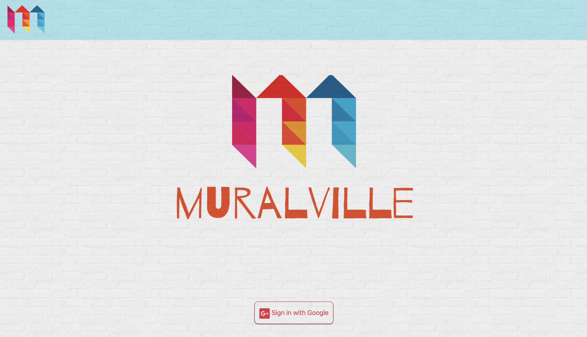
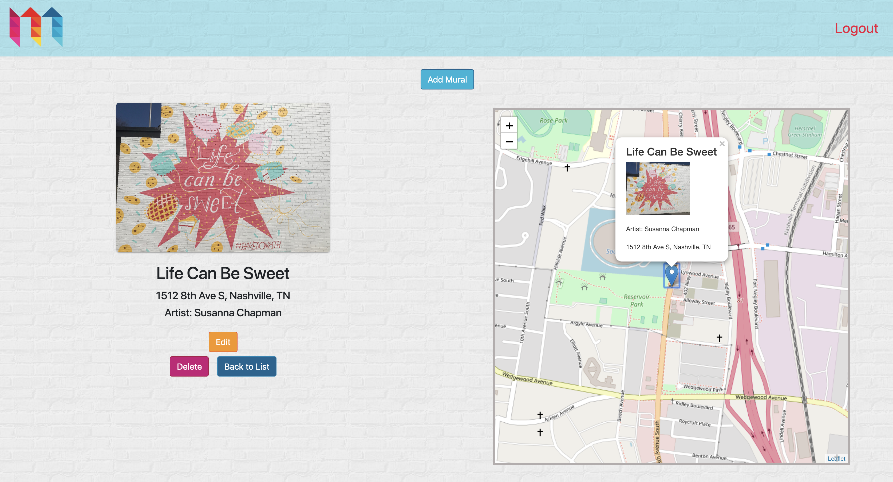
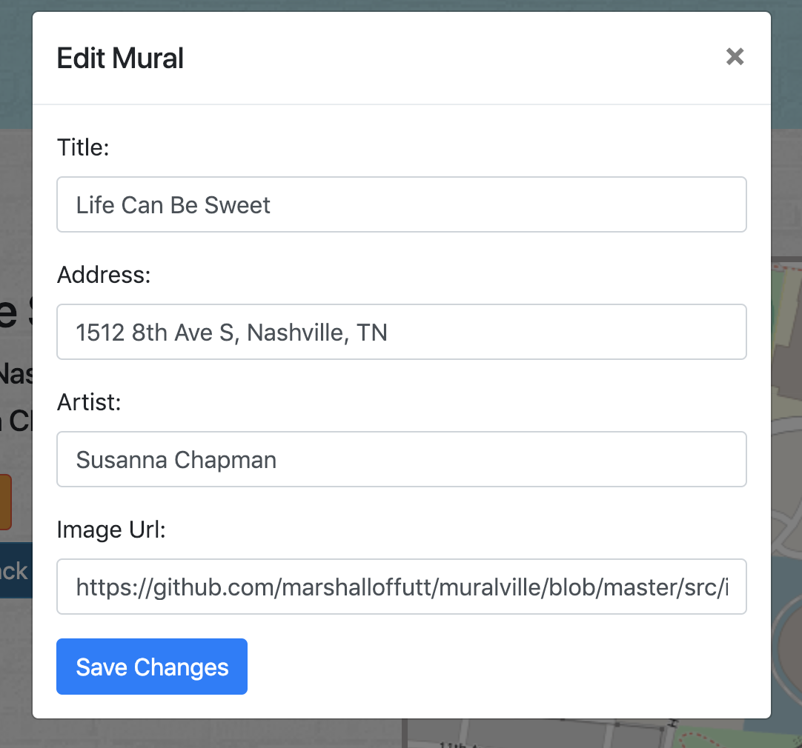

# Muralville

Muralville is my front end capstone project at NSS. It is a Nashville-centric community-based mural finder app & collaboration project that uses the React, Sass styling, and Leaflet as a map component.

Users can sign in via Google authentication, and then use the interface to look through all the different murals that have been added to the database. User can also add new murals, and edit or delete previous murals that they have added.

Muralville uses the Leaflet API, in conjunction with Esri and Bing Maps for geosearch capabilities, and autosuggest.

Current deployed build: [link](https://muralville.firebaseapp.com)

## Screenshots

### Authentication view


### Home view


### Individual mural view


### Modal to add/edit


## Technologies Used
* React
* Sass
* Axios
* Create-React-App
* Reactstrap
* Bootstrap
* Prop-Types
* Leaflet
* React-Leaflet
* Leaflet-Geosearch
* Bing Maps
* React-Bootstrap-Autosuggest
* Font Awesome

## How to run this app
Note: To run this app you will need a firebase account and a new project.

### 1. Configure Firebase
1. Clone the repository to your local machine.
2. Run the following command in terminal to download the web dependencies: `npm install`
3. In the db folder, rename apiKeys.json.example to apiKeys.json.
4. In Firebase, create a new project.
5. Navigate to your config object, and copy the keys from Firebase into the apiKeys.json file.
6. Create a realtime database in Firebase, and start in test mode.
7. Navigate to the Data tab inside the realtime database, and import `!base.json`. You should now see sets of data titled Murals, Users, and Favorites.
8. Click on Murals, and the import the `murals.json` file. Repeat for Users, and Favorites.
9. Navigate to the Rules tab, and add the following rule:
```
    "users": {
      ".indexOn": "uid"
    },
```

### 2. Configure Bing Maps
1. Sign up for a key at [Bing Maps dev center](https://www.bingmapsportal.com/)
2. Once assigned a key, copy the key and api endpoint from the Bing Maps portal into the apiKeys.json file.

### 3. Serve up the app
#### `npm start`

Runs the app in the development mode.<br>
Open [http://localhost:3000](http://localhost:3000) to view it in the browser.
